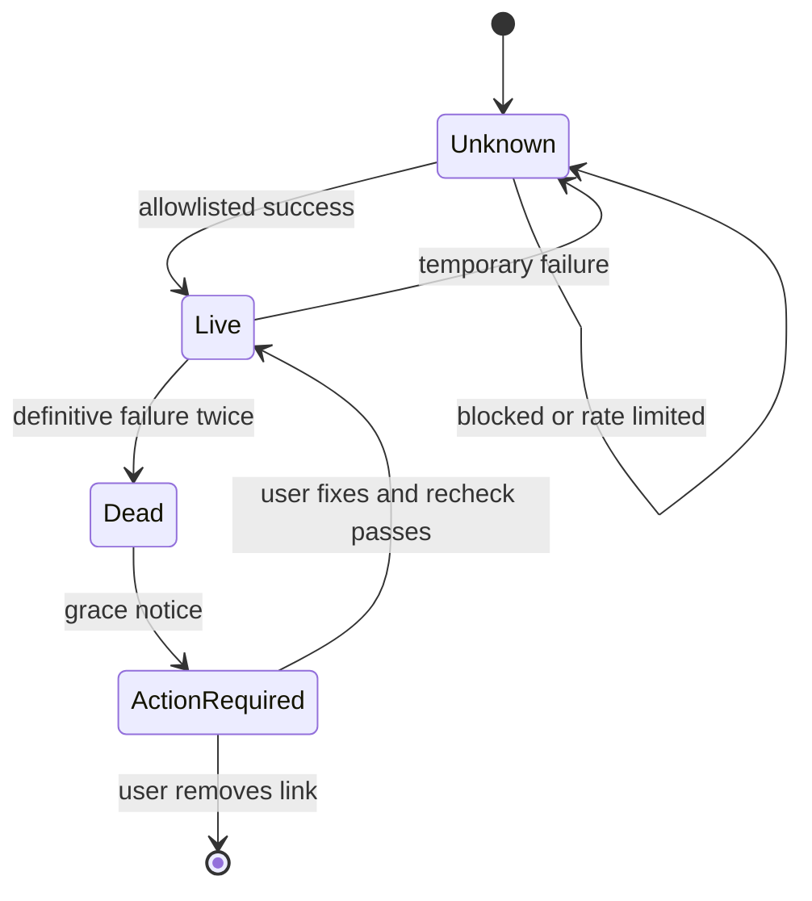
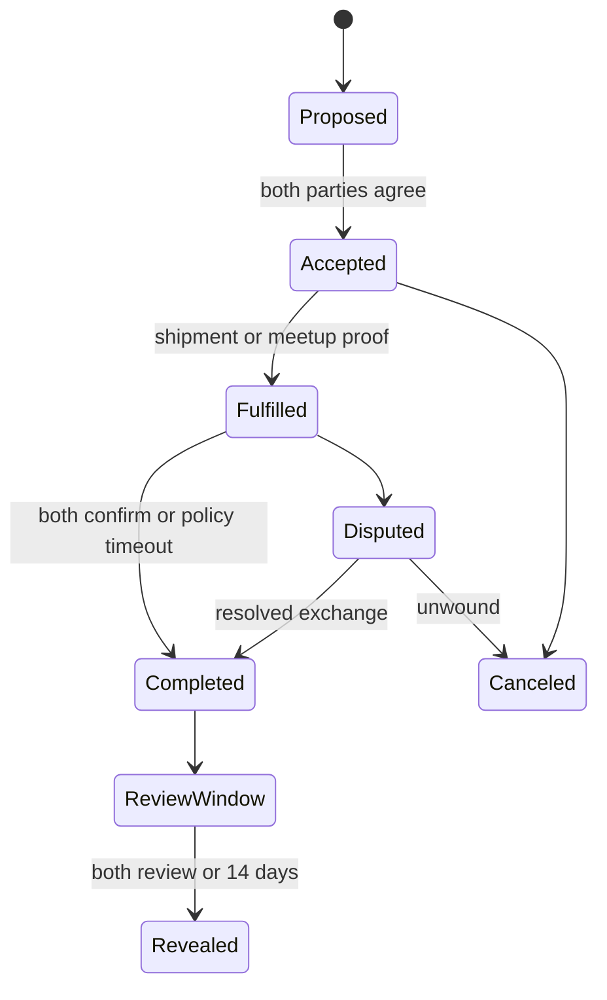

# Open Marketplace Social Trust Framework

Status: architecture contract and Cursor implementation plan
Version: 1.0
Updated: 2026-08-05

## 1. Product decision

Open Marketplace should be built around **evidence of reliable exchange**, not a
single opaque "trust score" and not a person's popularity on another platform.

The public trust system has five independent facets:

1. **Identity continuity** — how long this marketplace identity and its linked
   credentials have remained under the same user's control.
2. **Transaction reputation** — feedback that is tied to a completed exchange.
3. **Fulfillment reliability** — completion, cancellation, dispute, shipping,
   pickup, and response outcomes derived from marketplace events.
4. **Social context** — clickable social accounts, link health, provider
   attestation, claimed account age, and claimed or provider-supplied connection
   counts.
5. **Community safety** — policy standing, reports, appeals, and moderation
   outcomes, with private details kept out of public shaming systems.

These facets must remain visibly separate. Social follower or friend counts must
never increase search rank, unlock selling privileges, raise a rating, or cancel
out bad transaction history.

## 2. What the evidence supports

| Finding | Design consequence for Open Marketplace |
| --- | --- |
| eBay exposes feedback score, positive percentage, recent feedback, detailed seller ratings, registration date, and items sold. | Show both experience volume and role-specific feedback; do not show an average without its sample size. |
| eBay marks transaction feedback as a verified purchase and prohibits feedback trading, incentives, coordinated accounts, and artificial transactions. | Permit one review per party only after an authenticated completed transaction; detect collusion and never sell or reward positive reviews. |
| Airbnb hides two-sided reviews until both parties submit or a 14-day window ends. Its field experiment found more reviews and less retaliation/reciprocation under simultaneous reveal. | Use a 14-day double-blind review window. Let a reviewer edit only before reveal. |
| Research on eBay found reputation history predictive, but simple net scores were overly positive and reciprocal feedback distorted the signal. | Keep buyer and seller roles separate, show recent and lifetime views, and use confidence-aware aggregates rather than a net score. |
| Research on cheap pseudonyms shows that disposable identities let bad actors discard reputational consequences, while eliminating anonymity can create privacy and access costs. | Bind reputation to durable credentials and a device-held key, but offer several assurance levels instead of requiring government identity from everyone. |
| NIST SP 800-63-4 separates identity proofing, authentication, and federation assurance and calls for risk, privacy, usability, and equity assessment. | Store what was verified, by whom, when, and at what assurance level; do not collapse login strength and real-world identity into one badge. |
| OpenID Connect communicates identity claims after provider authentication; W3C Verifiable Credentials define portable, tamper-evident claims. | Use official OAuth/OIDC adapters for provider assertions and issue signed, exportable marketplace attestations later. |
| Provider APIs expose different fields and scopes, can require consent/app review, and change over time. | Never scrape private data or promise that account creation date or connection counts are available. Preserve a source and timestamp for every displayed metric. |
| The FTC's Consumer Reviews and Testimonials Rule prohibits several forms of fake reviews, purchased sentiment, review suppression, and fake social-influence indicators. | Keep immutable provenance, disclose moderation, prohibit incentivized sentiment, and never represent self-reported social metrics as verified. |

This framework draws on the sources listed in [Section 18](#18-primary-sources).

## 3. Non-negotiable rules

1. No universal social-credit number.
2. No rating without an authenticated, completed transaction.
3. No rating written directly into a profile aggregate.
4. Buyer and seller reputation remain separate.
5. Reviews are double-blind until both are submitted or the review window ends.
6. A social URL resolving proves link availability, not identity or character.
7. Every social fact displays its provenance: `provider`, `self-reported`, or
   `link check`.
8. Social counts are never ranking inputs or access-control inputs.
9. `unknown` link health is not treated as `dead`; provider blocking and rate
   limits must not punish a user.
10. A conclusively dead or invalid link places the profile in
    `social_action_required` until the user fixes or removes it.
11. Removed reviews and moderation actions leave non-sensitive audit tombstones.
12. Trust changes are derived from append-only events and can be recomputed.
13. The registry stores trust metadata and content hashes, never listing-image
    bytes, social passwords, session cookies, or raw identity documents.
14. Every adverse automated decision has an explanation and an appeal path.

## 4. Public trust card

Create one reusable `TrustCard` component with `compact`, `full`, and
`moderator` variants. Render the compact variant on every listing card and the
full variant on listing details, seller profiles, chat headers, offer screens,
checkout/meetup confirmation, review forms, and dispute pages.

### Compact variant

- marketplace member since date;
- `New`, `Active`, or `Established` experience label;
- seller rating, rating count, and completed sales;
- buyer rating and rating count;
- up to three clickable social chips with health/source state;
- a visible `Fix social link` action when the current user owns a profile in
  `social_action_required`;
- a `Why this is shown` disclosure.

### Full variant

- all compact fields;
- lifetime and recent-12-month reputation views;
- seller dimensions: item accuracy, communication, fulfillment;
- buyer dimensions: communication, payment/pickup, transaction care;
- completed/canceled/disputed transaction counts, with low-volume privacy
  thresholds;
- identity and authentication assurance badges;
- social account URL, handle, account date, connection count, source, health,
  and last successful refresh;
- review history with verified-transaction labels;
- public responses and review/moderation tombstones;
- profile data export and correction links.

### Display language

Use evidence labels, not moral labels.

Good:

- `4.8 from 23 completed sales`
- `TikTok · provider connected · 12,420 followers · refreshed 2d ago`
- `Facebook · link live · account age self-reported`
- `New seller · 1 completed sale`

Do not use:

- `98% trustworthy`
- `Good person`
- `Low social value`
- `Facebook verified` when only the URL resolved

## 5. Identity assurance ladder

Identity assurance is additive. Users can participate at the lowest level
allowed by instance policy, while higher-risk actions may require a higher tier.

| Tier | Evidence | Public label | Permitted use |
| --- | --- | --- | --- |
| A0 | Device-generated signing key | `Device secured` | Browse, save, draft |
| A1 | Verified email plus passkey/WebAuthn | `Account secured` | Ordinary listings under starter limits |
| A2 | One official OAuth/OIDC provider subject bound to the same profile | `Provider connected` | Higher listing limits and account recovery |
| A3 | Optional identity-proofing provider assertion | `Identity checked` | High-risk categories or limits where lawful |

Rules:

- Do not display email address, phone number, provider subject ID, authenticator
  details, or government name by default.
- A passkey proves control of an authenticator, not a legal identity.
- OAuth proves control of the provider account at the verification time, not
  that every public profile claim is accurate.
- Government identity should remain optional unless a transaction, category,
  payment provider, or law genuinely requires it.
- Account recovery and credential replacement must append events and preserve a
  visible continuity break when ownership cannot be strongly re-established.

## 6. Social account model

Replace profile-level JSON as the long-term source of truth with normalized
`social_connections` records. Keep JSON only as a read-compatible cache during
migration.

Required fields:

```ts
type SocialConnection = {
  id: string;
  profileId: string;
  provider: "facebook" | "instagram" | "tiktok" | "other";
  providerSubjectHash?: string; // keyed hash, never a raw public identifier
  canonicalUrl: string;
  handle?: string;
  status:
    | "oauth_verified"
    | "live"
    | "unknown"
    | "dead"
    | "invalid"
    | "expired"
    | "action_required";
  accountCreatedAt?: string;
  accountCreatedAtSource?: "provider" | "self_reported";
  connectionCount?: number;
  connectionLabel?: "friends" | "followers";
  connectionCountSource?: "provider" | "self_reported";
  verifiedAt?: string;
  lastCheckedAt?: string;
  lastSuccessfulRefreshAt?: string;
  consecutiveDefinitiveFailures: number;
  nextCheckAt?: string;
  scopesJson?: string; // names only, never tokens
  createdAt: string;
  updatedAt: string;
};
```

### Provider adapter contract

```ts
interface SocialIdentityAdapter {
  provider: SocialConnection["provider"];
  beginAuthorization(returnTo: URL): Promise<URL>;
  exchangeAuthorizationCode(input: {
    code: string;
    codeVerifier: string;
    redirectUri: string;
  }): Promise<EncryptedProviderGrant>;
  refreshPublicClaims(grant: EncryptedProviderGrant): Promise<{
    providerSubject: string;
    canonicalUrl: string;
    handle?: string;
    accountCreatedAt?: string;
    connectionCount?: number;
    connectionLabel?: "friends" | "followers";
    grantedScopes: string[];
    fetchedAt: string;
  }>;
  revoke(grant: EncryptedProviderGrant): Promise<void>;
}
```

Implementation constraints:

- Authorization Code flow with PKCE; exact redirect URIs; `state` and `nonce`;
  encrypted refresh grants; least-privilege scopes.
- Keep provider tokens out of browser storage, D1 plaintext, logs, URLs, and
  analytics.
- Feature-detect fields. If a provider does not supply account creation date or
  connection count, omit the provider value and clearly label an optional
  self-reported value.
- Never use unofficial scraping, pasted cookies, browser automation, or a
  user's social password.
- Refresh only with consent and within provider terms.
- Disconnecting an account removes/revokes the grant but preserves a minimal
  audit event and prior public-source labels where legally permitted.

## 7. Link-health lifecycle

Continue using the current allowlisted server checker in
`lib/social-health.ts`; do not replace it with arbitrary URL fetching.



Rules:

- `invalid`: malformed URL, unsupported scheme/host, unsafe redirect, or not a
  direct profile URL. Block saving that specific link.
- `dead`: a conclusive 404/410 or provider-specific unavailable marker,
  confirmed twice unless the provider response is unambiguous.
- `unknown`: timeout, robots challenge, rate limit, login wall, network failure,
  or ambiguous response. Do not penalize or block the user.
- `action_required`: a dead/invalid saved link. Prevent new listing publication,
  offers, and seller-contact initiation until the owner fixes or removes it;
  keep browsing and account correction available.
- Recheck on connect, profile edit, listing publication, and manual request.
- Lazy-refresh stale links on profile/listing reads. A scheduled worker should
  process a bounded queue; it must use exponential backoff and per-provider
  budgets to keep cost near zero.
- Suggested freshness: OAuth claims 24 hours while active; ordinary live links
  7 days; unknown links retry at 1 hour, 6 hours, then 24 hours; dead links wait
  for user action after confirmation.
- Every page reads current profile trust data, not a stale listing snapshot.

## 8. Transaction-bound reputation

Create a transaction before creating a rating.



For local pickup, generate a short-lived QR/nonce that both devices confirm.
For shipping, combine seller shipment declaration, optional carrier event, and
buyer receipt confirmation. No single client may mark both parties complete.

A transaction becomes review-eligible only when:

- buyer and seller are authenticated and distinct;
- the listing and accepted offer are bound to the transaction;
- the transaction reaches `completed`;
- neither party is a blocked duplicate identity;
- no prior review exists for that party, transaction, and role.

## 9. Double-blind reviews

- Review window: 14 days after completion.
- Buyer reviews seller; seller reviews buyer.
- A submitted review remains sealed until both reviews are submitted or the
  window expires.
- The author may edit only while the review is sealed.
- Once revealed, the original is immutable. A correction is a linked follow-up.
- The subject may post one public response.
- Removal is limited to documented policy reasons. Preserve a public tombstone
  such as `Review removed: prohibited personal information` without publishing
  the removed content.
- Never reveal whether the other party has reviewed, except that a sealed review
  exists and the common deadline.
- Never offer money, discounts, higher rank, or entry into a drawing in exchange
  for positive sentiment. Neutral reminders to review are allowed.

### Review dimensions

Seller review:

- overall experience, 1–5;
- item matched description, yes/no;
- communication, 1–5;
- fulfillment/pickup reliability, 1–5;
- optional text and structured tags.

Buyer review:

- overall experience, 1–5;
- communication, 1–5;
- payment/pickup reliability, 1–5;
- care/respect for the exchange, 1–5;
- optional text and structured tags.

Do not ask for traits unrelated to an exchange. Do not infer protected traits,
politics, worthiness, creditworthiness, or offline character.

## 10. Aggregation

Store raw review events. Build versioned projections for display.

### Bayesian rating

For a role/dimension with ratings `r`:

```text
display_mean = (prior_weight * marketplace_mean + sum(r))
               / (prior_weight + rating_count)
```

Start with `prior_weight = 5`, recompute `marketplace_mean` from eligible
reviews, and version the parameters. Show `New — 2 reviews` rather than a
precise rating below three reviews. Never hide the count.

### Reliability rate

For completion/cancellation binary outcomes, display a Wilson lower confidence
bound instead of a raw percentage when a public reliability badge needs a
threshold. This prevents `1 of 1` from looking equivalent to `100 of 100`.

### Time windows

- public lifetime count;
- recent 12-month aggregate;
- all-time aggregate;
- no silent deletion through decay.

Recent performance may control a badge, but the profile must explain the
window. Keep the underlying lifetime history exportable.

### Repeat-counterparty resistance

- Count at most one reputation contribution from the same counterparty pair in
  a rolling 30-day period toward public aggregates.
- Keep every legitimate transaction in private/account history.
- Flag dense reciprocal clusters for human review; do not auto-punish solely on
  graph similarity.
- Exclude reversed, fraudulent, staff/test, and policy-invalidated transactions
  through explicit projection rules, never by deleting events.

## 11. Storage model

The first Cursor implementation should add these normalized D1 tables:

| Table | Purpose |
| --- | --- |
| `profile_credentials` | WebAuthn/OIDC/identity assurance metadata and credential lifecycle; no raw secrets |
| `social_connections` | One normalized provider connection per profile/provider/subject |
| `transactions` | Buyer, seller, listing, accepted offer, status, completion, and dispute linkage |
| `transaction_events` | Append-only state changes with actor, reason, time, and event hash |
| `reviews` | One sealed/revealed review per transaction, reviewer, subject, and role |
| `review_dimensions` | Normalized dimension values and tags |
| `review_responses` | One public response plus follow-up corrections |
| `trust_events` | Append-only identity, social, reputation, and moderation provenance |
| `trust_projections` | Recomputable, versioned public aggregates for fast reads |
| `disputes` | Workflow state and non-media metadata |
| `moderation_actions` | Scoped action, rule, issuer, expiry, appeal, and tombstone |
| `appeals` | User challenge, review state, decision, and public explanation |

Critical constraints:

- unique `(transaction_id, reviewer_id, role)` review;
- buyer and seller must differ;
- subject must be the counterparty for that role;
- only completed transactions accept reviews;
- review `revealed_at` set only by both-submitted or deadline job;
- unique active provider subject binding across profiles unless an audited merge
  is in progress;
- every projection records `projection_version`, `calculated_at`, and last event
  cursor;
- every mutation checks authenticated ownership on the server.

SQLite/D1 cannot express every cross-row rule in a `CHECK`; enforce them inside
a transaction in the domain service and test them directly.

## 12. Event envelope and portability

Canonical trust events should be signed by the issuing marketplace node and,
where meaningful, acknowledged by the user's device key.

```ts
type TrustEventEnvelope = {
  eventId: string;
  subjectProfileId: string;
  actorProfileId?: string;
  eventType: string;
  occurredAt: string;
  payloadHash: string;
  priorEventHash?: string;
  registryId: string;
  schemaVersion: number;
  signature: string;
};
```

Phase 4 can issue a W3C Verifiable Credential for bounded claims such as:

- `completed 25 seller transactions on registry X`;
- `seller aggregate 4.8/5 from 23 eligible reviews under algorithm v2`;
- `provider connection controlled at timestamp T`.

The registry is the issuer of its transaction claims. A self-signed statement
is not shown as third-party verification. Credentials need status/revocation,
expiry, data minimization, and selective disclosure. Never export private
review text, social tokens, device fingerprints, or dispute evidence by default.

## 13. APIs

Suggested routes:

```text
POST   /api/auth/passkey/register/options
POST   /api/auth/passkey/register/verify
GET    /api/social/:provider/authorize
GET    /api/social/:provider/callback
POST   /api/social/:connectionId/recheck
DELETE /api/social/:connectionId
POST   /api/transactions
POST   /api/transactions/:id/events
GET    /api/transactions/:id/review-eligibility
POST   /api/transactions/:id/reviews
PATCH  /api/reviews/:id                 # sealed only
POST   /api/reviews/:id/response
POST   /api/reviews/:id/report
GET    /api/profiles/:id/trust
GET    /api/profiles/:id/trust/export
POST   /api/disputes
POST   /api/appeals
```

Every write route must define authentication, authorization, idempotency key,
rate limit, audit event, safe error response, and retry behavior.

`GET /api/profiles/:id/trust` is the single public read model used on every page.
It returns facets and evidence, not one total score.

## 14. Ranking and enforcement

Trust information should help a buyer decide; it should not secretly determine
who gets seen.

- Default search ranking uses relevance, recency, price/distance preference,
  and listing completeness.
- A user may explicitly filter for minimum completed transactions or a
  provider-connected profile.
- Public reputation can be a small, documented tie-breaker only after a fairness
  review and opt-out experiment.
- Social connection counts are never ranking features.
- Private fraud signals may add friction, rate limits, or manual review. They
  must not become public accusations.
- Permanent marketplace restrictions require a documented rule, evidence,
  notice, and appeal.
- New users receive limits and clear steps, not an automatically bad rating.

## 15. Threat model

| Threat | Required control |
| --- | --- |
| Disposable accounts | Durable device key, verified contact, provider subject uniqueness, progressive limits |
| Fake completed trades | Two-party completion, offer/listing binding, value/velocity checks, collusion review |
| Retaliatory reviews | Double-blind reveal and fixed review deadline |
| Review extortion | Report flow, immutable messages/event hashes, anti-extortion policy, moderator action |
| Purchased/incentivized reviews | Transaction eligibility, incentive prohibition, cluster/velocity detection |
| Social metric fabrication | Source labels, official adapters, no score/ranking effect |
| Link checker false positive | Separate `unknown` from `dead`, confirm definitive failures, manual recheck |
| SSRF through profile URLs | HTTPS provider allowlist, redirect allowlist, response/time/size caps |
| Credential theft | Passkeys, encrypted grants, rotation/revocation, no browser token storage |
| Moderator abuse | Append-only actions, reason codes, least privilege, public transparency reports |
| Reputation reset/transfer | Audited merge/recovery events and visible continuity breaks |
| Privacy leakage | Minimum public fields, count thresholds, hashed provider subjects, export/delete controls |
| Algorithmic bias | No social-popularity score, facet explanations, outcome audits, appeals, versioned projections |

## 16. Cursor delivery plan

Cursor should implement this in small pull requests. Do not build OAuth,
transactions, reviews, moderation, and portable credentials in one change.

### PR 1 — Trust domain foundation

- Add domain types and state-machine tests.
- Add normalized tables, indexes, constraints, and a reviewed Drizzle migration.
- Create append-only event service and versioned projection interface.
- Keep existing profile JSON reads working through a compatibility adapter.
- Add fixtures for new, active, established, suspended, and social-action-required
  profiles.

Definition of done:

- migrations apply to an empty and existing database;
- invalid state transitions and duplicate reviews fail;
- projections rebuild deterministically from fixtures;
- no image bytes or secrets enter D1.

### PR 2 — Transaction lifecycle

- Add authenticated profile/listing ownership.
- Add offer acceptance and transaction events.
- Add two-party local meetup confirmation nonce.
- Add transaction history and review eligibility endpoint.
- Add idempotency and rate limits.

Definition of done:

- neither party can complete both sides;
- canceled/unresolved transactions cannot be reviewed;
- authorization tests cover buyer, seller, stranger, and moderator.

### PR 3 — Double-blind reviews

- Add sealed review creation/editing and 14-day reveal job.
- Add buyer/seller dimensions, public response, report, and tombstone.
- Add Bayesian/reliability projections with algorithm version.
- Replace demo aggregates with projections from eligible reviews.

Definition of done:

- no party sees the counterparty review before reveal;
- late, duplicate, self, and non-transaction reviews fail;
- review removal cannot erase the audit trail;
- public UI always shows score with count and time window.

### PR 4 — Trust card everywhere

- Build one accessible `TrustCard` component with compact/full variants.
- Use the current trust read model on all listing, profile, chat, offer,
  transaction, review, and dispute surfaces.
- Add evidence/source disclosures and action-required owner UI.
- Add explicit trust filters without making popularity a default rank factor.

Definition of done:

- desktop/mobile/keyboard/screen-reader tests pass;
- no stale listing snapshot overrides a current profile state;
- every metric exposes source, count, period, and refresh time where applicable.

### PR 5 — Social OAuth adapters

- Build provider-neutral PKCE callback/grant service.
- Implement one provider end-to-end before adding the others.
- Normalize available claims; omit unsupported fields.
- Add encrypted token storage, revocation, refresh/backoff, and consent UI.
- Preserve allowlisted URL health as a separate signal.

Definition of done:

- no token appears in client storage/logs/URLs;
- provider disconnect and revocation work;
- a missing scope or unavailable metric degrades honestly;
- self-reported fields never receive a provider badge.

### PR 6 — Safety, appeals, and transparency

- Add dispute, moderation, review report, and appeal state machines.
- Add scoped/expiring actions and public reason categories.
- Publish aggregate transparency metrics without exposing complainants.
- Add moderator permission and audit tests.

### PR 7 — Portable trust

- Define canonical event serialization and registry signing keys.
- Export a signed trust bundle.
- Add W3C VC-compatible bounded claims, status, expiry, and verification.
- Import external claims as separately labeled evidence, never as native ratings.

## 17. Cursor AUTO prompt

Paste this prompt into Cursor after checking out the repository:

> Read `CURSOR_START_HERE.md`, `SOCIAL_TRUST_FRAMEWORK.md`,
> `ARCHITECTURE.md`, `POLICY.md`, the current Drizzle schema, and all trust/social
> code before editing. Implement only PR 1 from the Social Trust delivery plan.
> Preserve local-only listing images, the allowlisted social-link checker, the
> restricted-items policy, and current read compatibility. Use append-only trust
> events and deterministic versioned projections. Do not create a universal trust
> score, do not use social popularity in ranking, and do not expose a rating write
> without a completed authenticated transaction. Generate and inspect the D1
> migration, add state-machine/projection/authorization tests, run lint and the
> complete test suite, and document every trade-off and environment variable in
> the PR.

After PR 1 is reviewed and merged, replace `PR 1` with the next numbered phase.

## 18. Primary sources

- [Airbnb: how long users have to write a review](https://www.airbnb.com/help/article/995)
- [Airbnb: authentic and trustworthy reviews](https://www.airbnb.com/help/article/2673)
- [Fradkin, Grewal, and Holtz: Airbnb simultaneous-reveal field experiment](https://business.columbia.edu/faculty/research/reciprocity-and-unveiling-two-sided-reputation-systems-evidence-experiment-airbnb)
- [eBay: feedback profiles](https://www.ebay.com/help/account/changing-account-settings/feedback-profiles?id=4204)
- [eBay: seller ratings](https://www.ebay.com/help/selling/seller-performance/feedback-guide?id=4023)
- [eBay: leaving feedback and verified-purchase labeling](https://www.ebay.com/help/buying/leaving-feedback-sellers/leaving-feedback-sellers?id=4007)
- [eBay: feedback manipulation policy](https://www.ebay.com/help/policies/feedback-manipulation-policy/feedback-manipulation-policy?id=4231)
- [Resnick and Zeckhauser: empirical analysis of eBay reputation](https://presnick.people.si.umich.edu/papers/ebayNBER/RZNBERBodegaBay.pdf)
- [Bolton, Greiner, and Ockenfels: Engineering Trust](https://cramton.umd.edu/market-design-papers/bolton-greiner-ockenfels-engineering-trust.pdf)
- [Friedman and Resnick: The Social Cost of Cheap Pseudonyms](https://www.presnick.people.si.umich.edu/papers/identifiers/081199.pdf)
- [NIST SP 800-63-4 Digital Identity Guidelines](https://csrc.nist.gov/pubs/sp/800/63/4/final)
- [OpenID Connect Core 1.0](https://openid.net/specs/openid-connect-core-1_0.html)
- [W3C Web Authentication Level 3](https://www.w3.org/TR/webauthn-3/)
- [W3C Verifiable Credentials Data Model 2.0](https://www.w3.org/TR/vc-data-model-2.0/)
- [TikTok API v2: Get User Info](https://developers.tiktok.com/doc/tiktok-api-v2-get-user-info)
- [Meta: Instagram Platform overview](https://developers.facebook.com/documentation/instagram-platform.md/)
- [FTC: Consumer Reviews and Testimonials Rule Q&A](https://www.ftc.gov/business-guidance/resources/consumer-reviews-testimonials-rule-questions-answers)
